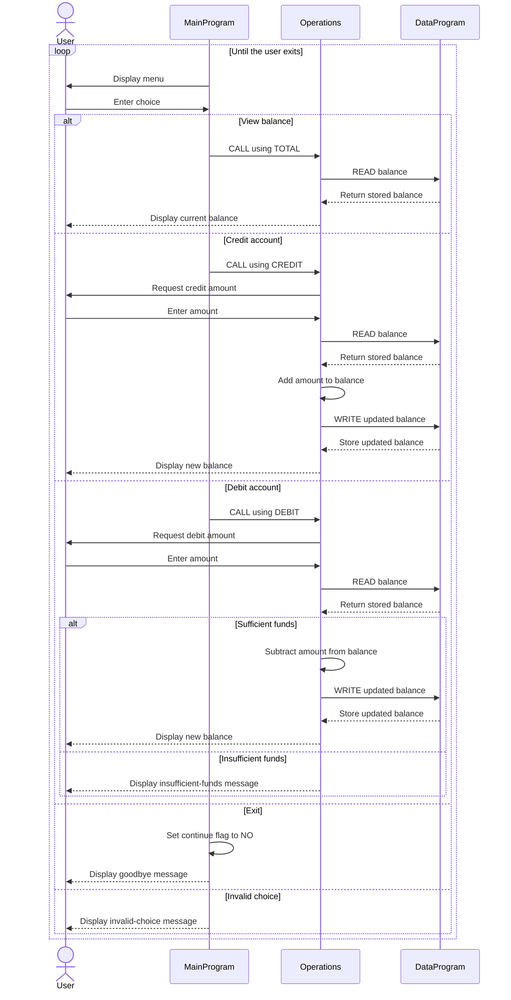

# Student Account COBOL Programs

This directory documents the COBOL sample in [`src/cobol`](../src/cobol). The program is a console-based student account management system. It supports viewing a balance, crediting an account, debiting an account, and exiting.

## Program Overview

| File | Purpose |
| --- | --- |
| [`main.cob`](../src/cobol/main.cob) | Provides the interactive menu and routes the user's selection to the operations program. |
| [`operations.cob`](../src/cobol/operations.cob) | Implements balance inquiries, credits, and debits. It reads and writes the balance through `DataProgram`. |
| [`data.cob`](../src/cobol/data.cob) | Stores the account balance and exposes simple `READ` and `WRITE` operations to other programs. |

## Key Functions

### `main.cob` - `MainProgram`

- Repeatedly displays the account management menu until the user selects Exit.
- Accepts a numeric choice from 1 through 4.
- Calls `Operations` with one of these six-character operation codes:
  - `TOTAL ` to view the current balance.
  - `CREDIT` to add funds.
  - `DEBIT ` to subtract funds.
- Displays an error for any other menu choice.

### `operations.cob` - `Operations`

- `TOTAL `: Reads the stored balance and displays it.
- `CREDIT`: Accepts an amount, reads the current balance, adds the amount, writes the result, and displays the new balance.
- `DEBIT `: Accepts an amount, reads the current balance, and subtracts the amount only when sufficient funds are available. A successful debit is written back and displayed; an unsuccessful debit displays an insufficient-funds message.

### `data.cob` - `DataProgram`

- Starts with a balance of `1000.00`.
- Accepts a six-character operation code and a balance passed through the linkage section.
- `READ` copies the stored balance to the caller's balance field.
- `WRITE` replaces the stored balance with the caller's balance.
- Returns control to the caller with `GOBACK`.

## Student Account Business Rules

- The initial account balance is `1000.00`.
- Credits increase the account balance by the entered amount.
- Debits are allowed only when the current balance is greater than or equal to the entered amount.
- A debit that exceeds the current balance is rejected and does not change the stored balance.
- Successful credits and debits persist for subsequent operations during the program run through `DataProgram`.
- The balance and transaction amount use a numeric format with two decimal places and support values up to `999999.99`.
- The source does not define validation for negative amounts, zero amounts, malformed input, interest, fees, student identifiers, or persistent storage beyond the program run.

## Call Flow

```text
MainProgram
    |-- TOTAL / CREDIT / DEBIT --> Operations
                                      |-- READ / WRITE --> DataProgram
```

## Application Sequence


